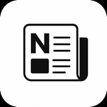
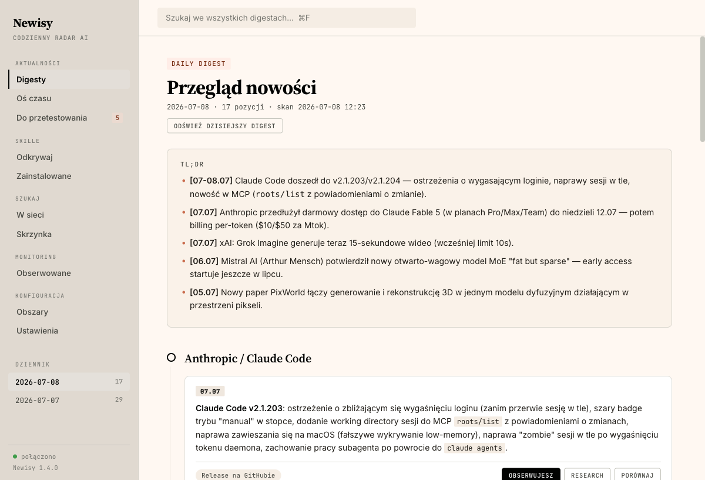
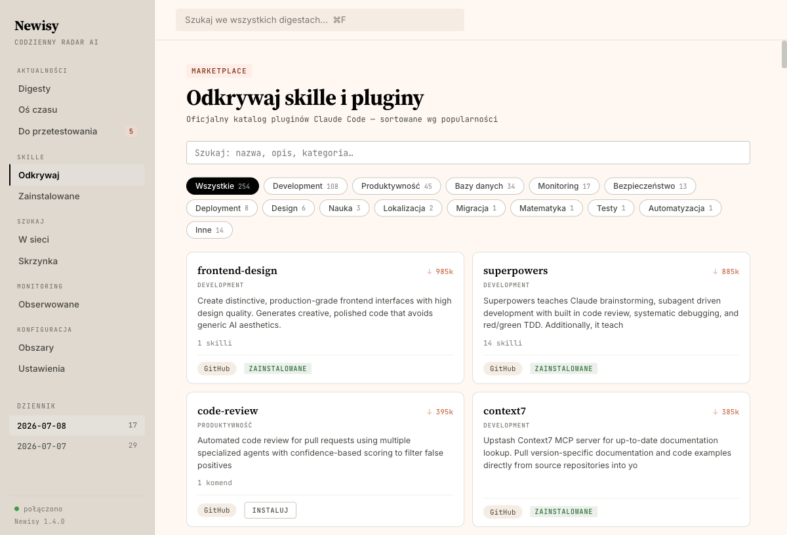
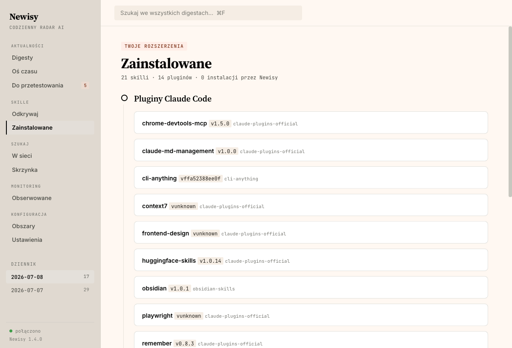

<div align="center">



# Newisy

### Twój codzienny radar nowości AI — natywna aplikacja na macOS

Newisy każdego ranka przeszukuje internet i Twoją skrzynkę, buduje zwięzły, datowany digest w Twoich dziedzinach — i pozwala od razu zainstalować to, co warto. Bez szumu. Bez rozpraszaczy. Tylko to, co ważne.

[](#instalacja)
[](#instalacja)
[](#prywatno%C5%9B%C4%87)
[](#baza-notatek)

**[Pobierz](https://github.com/piotrzeeee/newisy-releases)** · [Funkcje](#funkcje) · [Jak działa](#jak-działa) · [Dostawcy AI](#dostawcy-ai)



</div>

---

## Dlaczego Newisy

Świat AI pędzi. Nowe modele, skille, pluginy, serwery MCP, narzędzia — codziennie. Newsletterów jest mnóstwo, ale żaden nie zna **Twoich** zainteresowań i nie zapisuje niczego u Ciebie. Newisy to Twój osobisty agent‑researcher, który:

- pracuje na **Twojej** subskrypcji Claude Code albo kluczu API,
- pisze **po polsku**, zwięźle, z linkami do źródeł i **datą każdego wydarzenia**,
- zapisuje wszystko jako zwykłe pliki **Markdown** (otwierasz je też w Obsidianie),
- działa **lokalnie** — nic nie wysyła w świat poza zapytaniami do wybranego dostawcy AI.

## Funkcje

| | |
|---|---|
| 📡 **Codzienny digest** | Automatyczny przegląd nowości w Twoich obszarach — TL;DR, sekcje tematyczne, każdy news z datą `[DD.MM]` i linkiem źródłowym. |
| 🎯 **Twoje dziedziny** | Sam definiujesz obszary — dowolne tematy, nie tylko AI. Agent researchuje każdy z osobna. |
| 🔎 **Pogłębiony research** | Jednym kliknięciem agent drąży temat głębiej i zapisuje notatkę. |
| 💬 **Zapytaj (AI search)** | Konwersacyjna wyszukiwarka jak Perplexity — pyta, analizuje, porównuje i rekomenduje, z wątkami do powrotu i akcjami „Zainstaluj/Obserwuj" wprost z odpowiedzi. |
| 🛍️ **Marketplace „Odkrywaj"** | Przeglądaj **254 pluginy** Claude Code po kategoriach i popularności, instaluj jednym klikiem. |
| ✅ **Do przetestowania** | Checklist rzeczy wartych uwagi — auto‑odhaczana, gdy coś już zainstalujesz/zaktualizujesz. |
| 📬 **Skrzynka Gmail** | Newisy wyłuskuje istotne maile (np. zmiany w usługach, których używasz) i odfiltrowuje reklamy. |
| 🔔 **Obserwowane repo** | Śledź repozytoria GitHub — powiadomienie systemowe przy każdej nowej wersji. |
| 🕑 **Oś czasu** | Cała historia nowości z filtrem dat; zbadaj też okres sprzed instalacji. |
| 🔐 **Własny dostawca AI** | Claude Code, Anthropic API albo OpenRouter — klucze lokalnie, zero vendor lock‑in. |
| 🤖 **Zarządzanie z Claude Code** | Skonfiguruj i steruj Newisy przez rozmowę z agentem — skill + serwer MCP instalowane jednym kliknięciem. |

## Zrzuty ekranu

**Marketplace — odkrywaj i instaluj skille**



**Zainstalowane — pełny wgląd w Twoje rozszerzenia**



## Jak działa

1. **Pobierasz** aplikację i przeciągasz do Aplikacji.
2. **Wybierasz dostawcę AI** — Claude Code (jeśli masz), albo wklejasz klucz Anthropic/OpenRouter.
3. **Ustawiasz obszary** — o czym chcesz wiedzieć.
4. **Czytasz** — codzienny digest pojawia się o wybranej godzinie w pasku menu i w pełnym oknie.

Newisy siedzi w pasku menu (jak Handy). Klikasz ikonę → panel; z panelu otwierasz pełne okno.

## Dostawcy AI

Newisy nie ma własnego backendu — używasz swojego dostawcy:

- **Claude Code (subskrypcja)** — zero dodatkowych kosztów, jeśli masz zainstalowane Claude Code.
- **Anthropic API** — własny klucz, bezpośrednie wywołania z web search.
- **OpenRouter** — dowolny model (np. tani do researchu).

## Prywatność

Wszystko dzieje się na Twoim Macu. Klucze i hasła trzymane są w **Keychain** oraz lokalnym pliku z uprawnieniami tylko dla Ciebie (przeżywają aktualizacje). Newisy **nie zbiera telemetrii** i nie wysyła Twoich danych nigdzie poza zapytaniami do wybranego dostawcy AI. Poczta czytana jest przez IMAP z **hasłem aplikacji** — czytamy tylko nagłówki.

## Baza wiedzy (Obsidian + agenci AI)

Newisy zapisuje **wszystko jako zwykłe pliki Markdown** w wybranym folderze — digesty (`Dziennik/`), pogłębiony research (`Research/`), porównania i wyniki wyszukiwań — połączone wikilinkami `[[...]]` z centralnym `Home.md`.

To daje Ci dwie rzeczy za darmo:

- **Obsidian** — otwórz ten folder jako vault i masz w pełni linkowaną, przeszukiwalną bazę wiedzy o świecie AI, rosnącą każdego dnia.
- **Dostęp dla agentów AI** — ponieważ to zwykły Markdown na dysku, każdy agent (Claude Code i inne) może **czytać, przeszukiwać i wykorzystywać** tę wiedzę w Twoich projektach. Newisy nie jest zamkniętą aplikacją — buduje Ci trwałą, otwartą bazę, z której korzystasz dalej.

## Zarządzanie z Claude Code (MCP + skill)

Newisy możesz **skonfigurować i obsługiwać przez rozmowę z Claude Code**. W aplikacji: **Konfiguracja → Claude Code → Zainstaluj skill + MCP** (jedno kliknięcie — Newisy zapisuje globalny skill `newisy` i rejestruje serwer MCP przez `claude mcp add`).

Potem w Claude Code możesz np.:

- „**skonfiguruj mi Newisy**" — agent przeprowadzi Cię przez setup: sam zaproponuje obszary zainteresowań, dopyta o priorytety, kadencję digestu, strefę i dostawcę AI, po czym zapisze idealną konfigurację.
- „**dodaj obserwację repo anthropics/claude-code**", „**odpal dziś digest**", „**poszukaj: nowe modele NVIDIA**", „**co było w digestach w tym tygodniu?**" — agent steruje aplikacją narzędziami MCP.

Serwer MCP to ten sam plik aplikacji uruchamiany w trybie `--mcp-serve` (stdio) — zero dodatkowych zależności. Klucze API i hasła **nie są** ustawiane przez agenta (zostają w Ustawieniach aplikacji).

## Instalacja

1. Pobierz najnowszy `.dmg` z [Releases](https://github.com/piotrzeeee/newisy-releases).
2. Otwórz i przeciągnij **Newisy** do Aplikacji.
3. Uruchom — ikona radaru pojawi się w pasku menu.

> Wymaga macOS 14+. Aplikacja jest podpisana Developer ID i **notaryzowana przez Apple** — otwiera się normalnie, bez ostrzeżeń Gatekeepera.

## Auto‑aktualizacje

Newisy codziennie sprawdza [Releases](https://github.com/piotrzeeee/newisy-releases) i pokazuje dyskretną pigułkę „Aktualizacja X — Pobierz" w rogu okna.

## Dla deweloperów

```bash
macos/build.sh            # build + podpis + instalacja do /Applications
macos/build.sh release    # + Newisy-<wersja>.dmg
```

Architektura: natywny shell **SwiftUI** (menu bar + okno) + wbudowany serwer HTTP (`Network.framework`) serwujący interfejs **SPA** i API na `127.0.0.1`. Warstwa AI abstrahuje dostawców (Claude CLI / Anthropic / OpenRouter). Zero zależności zewnętrznych. Szczegóły w [`docs/`](docs/).

---

<div align="center">
<sub>Zbudowane z ☕ na macOS · © 2026 Newisy</sub>
</div>
